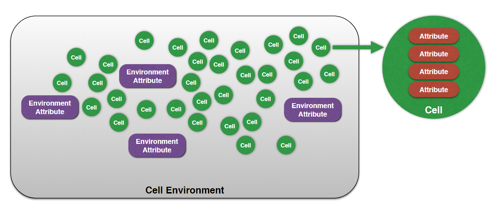

# ParaCells

ParaCells is a lightweight, versatile, and easy-to-use simulation architecture for computational system biology.

## Overview

### Concepts

In the ParaCells architecture, there are 5 core concepts used in developing process. These concepts (objects) can be controled to implement your own models.



* **Cell Environment** is a global concept of an environment. You can consider it as a virtual laboratory environment. We put a number of cells inside this environment, while each cell has several attributes. Between cells, the environment itself has some status as well, called environment parameters. Cells' attribute could be affected by environment, or it can affect the environment in turn. Of course, inside a program, it is possible to have more than one "Cell environment" simultaneously.
* **Cell** represents a single cell inside "Cell environment", it has several numerical attributes named "Cell attribute".
* **Cell Attribute** is a single numerical value, indicating a kind of attribute of a cell. (Only single-precision floating point value supported now)
* **Environment** represents extra-cellular environment between individual cells, it has several numerical attributes named "Environment attribute".
* **Environment Attribute** is a single numerical value, indicating a kind of attribute of the environment space. (Only single-precision floating point value supported now)

> In a "Cell environment", all cells should have the same kinds of attributes.

### Object-Oriented Model Declaration

ParaCells library exposes functionalities in an object-oriented way. Concepts listed above are all classes or properties in the code level.

"Cell environment" corresponds to a class "CellEnv" in the ParaCells architecture. It has all the functionalities to control this "virtual laboratory", ranging from add cells, "Cell attributes", "Environment attributes" to set or get "Cell attribute", even parallelly update all cells status. Full methods and functionalities are listed in later sections.

"Cell" and "Environment" corresponds to classes with the same name in the ParaCells architecture. Objects of class "Cell" usually repersents one cell in "Cell environment", providing functionalities of get or set "Cell attributes", make the cell die or proliferate, etc. Objects of class "Environment" deontes the whole environment spaces in "Cell environment", providing functionalities of get or set "Environment attributes", generate uniform or poisson distributed random numbers, etc.

Concepts "Cell attribute" and "Environment attribute" are mainly properties inside those classes, so you can obtain or modify them through methods provided.

> "CellEnv" class can only be used in ```Main.cu```, while "Cell" and "Environment" classes can only be accessed through parameters of ```Custom functions``` in ```CustomFunctions.cuh```.

## Additional Documentation

* [Start Developing with ParaCells](doc/start_developing_with_ParaCells.md)
* [Examples Based on ParaCells](doc/examples_based_on_ParaCells.pdf)
* [API References](doc/api_references.md)

## Installation & Usage

### Prerequisites

* Ubuntu 16.04 LTS
* NVIDIA CUDA Toolkits 7.5

> ParaCells architecture is expected to work properly on the higher version of Ubuntu operating systems and the newer CUDA Toolkits, but the compatibility has not been fully tested.

### Create a ParaCells Project

To create a new ParaCells project, just copy all the files in the ```src/``` directory into a new folder.
Then the new directory can be temporarily considered as an individual ParaCells project.

### Project File Structure

The file structure of a ParaCells project is:

```
.
├── /bin
|   ├── run
├── Makefile
├── Base.cuh
├── Base.cu
├── BuiltInKernels.cuh
├── ...
├── Main.cu
└── CustomFunctions.cuh
```

* The ```/bin``` directory are runtime files for compiling and running. It may not be exist at the beginning.
* The ```Makefile``` is the execution script for project compilation, so that there is no need for you to look at or modify it.
* The ```Main.cu``` and ```CustomFunctions.cuh``` is the place where user implements their models for simulation. **[These are the only files needed to be modified]**
* The rest of files, such as ```Base.cuh``` and ```Base.cu``` are all library files, they should not be modified as well.

### Compilation

When finish coding, instructions below could be used to compile the project.

1. Open Terminal;
2. Located in the directory where the project is placed;
3. Execute command:

	```
	$ make
	```

> Logs of the compiling process would be printed into the prompt, including warnings and errors.

### Simulation Execution

**Only projects that compiled successfully could be executed.**

To run a ParaCells project for computing or simulation, follow instructions:

1. Open Terminal;
2. Located in the directory where the project is placed;
3. Execute command:

	```
	$ make run
	```

### Build Clean

If you want to remove the previous build, instructions below could be used to clean the project.

1. Open Terminal;
2. Located in the directory where the project is placed;
3. Execute command:

	```
	$ make clean
	```

## License

MIT